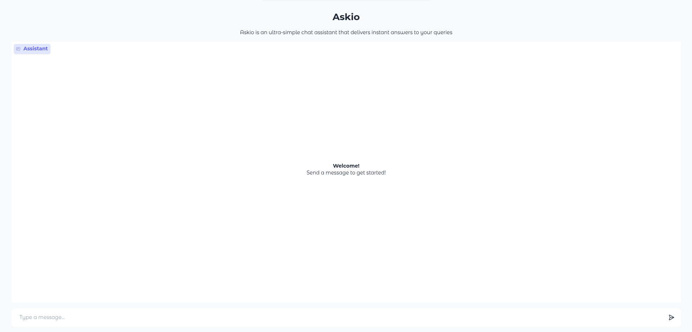

# 🤖 Askio

Askio is an asynchronous, event-driven chat system powered by **FastAPI**, **PostgreSQL**, **Ollama**, **Gradio**, and **FastStream** (RabbitMQ).



---

## 📦 Components

| Name       | Path                 | Description                                |
| ---------- | -------------------- | ------------------------------------------ |
| 🌐 `API`    | [`api`](./api)       | Public-facing HTTP API built with FastAPI  |
| 💬 `Chat`   | [`chat`](./chat)     | LLM-based response generation using Ollama |
| 🧑‍💻 `Client` | [`client`](./client) | Gradio-based user interface                |
| 🗃️ `DB`     | [`db`](./db)         | PostgreSQL database layer                  |

---

## 🚀 How to Start

Make sure you have **Docker** and **Docker Compose** installed.

> ⚠️ `.env` file **must** exist in the root folder with the required environment variables.

Create a file named `.env` in the **root** directory with the following content:

```ini
OLLAMA_HOST=ollama
OLLAMA_PORT=11434
OLLAMA_MODEL=gemma3:latest

POSTGRES_USER=postgres
POSTGRES_PASSWORD=postgres
POSTGRES_DB=askio
POSTGRES_HOST=postgres
POSTGRES_PORT=5432

RABBITMQ_USER=guest
RABBITMQ_PASSWORD=guest
RABBITMQ_HOST=rabbitmq
RABBITMQ_PORT=5672

CHAT_NAME=chat

DB_NAME=db

API_NAME=api
API_HOST=0.0.0.0
API_PORT=8000

CLIENT_NAME=client
CLIENT_HOST=0.0.0.0
CLIENT_PORT=7860
```

> ⚠️ Without this file, services will not be able to start and connect to each other.

To start the full system:

```bash
docker-compose up --build
```

This command will:

* Build all four services
* Start RabbitMQ, PostgreSQL, and Ollama
* Launch all components in the correct order

Once running:

* Access the client at: [http://localhost:7860](http://localhost:7860)
* The API (if needed) will be available at: [http://localhost:8000/docs](http://localhost:8000/docs)

---

## 🧰 Technologies

* 🔗 **[Python](https://www.python.org/)** – core programming language used across all components
* 🔗 **[FastAPI](https://fastapi.tiangolo.com/)** – web framework for building async APIs
* 🔗 **[Pydantic](https://docs.pydantic.dev/latest/)** – data validation and serialization library
* 🔗 **[Pydantic Settings](https://docs.pydantic.dev/latest/concepts/pydantic_settings/)** – extension of Pydantic for managing settings and environment variables
* 🔗 **[FastStream](https://faststream.ag2.ai/latest/)** – async message streaming framework (RabbitMQ, Kafka, etc.)
* 🔗 **[RabbitMQ](https://www.rabbitmq.com/)** – message broker for inter-service communication
* 🔗 **[PostgreSQL](https://www.postgresql.org/)** – relational database
* 🔗 **[SQLAlchemy](https://www.sqlalchemy.org/)** – ORM for PostgreSQL
* 🔗 **[Asyncpg](https://magicstack.github.io/asyncpg/current/)** – high-performance asynchronous PostgreSQL database driver for Python
* 🔗 **[Ollama](https://ollama.com/)** – local LLM runtime and model management
* 🔗 **[Gradio](https://www.gradio.app/)** – web UI toolkit
* 🔗 **[Requests](https://requests.readthedocs.io/en/latest/)** – simple and elegant HTTP client for API calls in Python
* 🔗 **[Docker](https://www.docker.com/)** – container platform
* 🔗 **[Docker Compose](https://docs.docker.com/compose/)** – multi-container orchestration tool

---

## 🔧 System Highlights

* **🌀 Asynchronous**

  Components use Python’s `asyncio` for non-blocking execution, ensuring high concurrency and scalability across the system.

* **📨 Event-Driven Architecture**

  Components communicate via **FastStream** and **RabbitMQ**, promoting decoupling, modularity, and ease of scaling or replacing individual services.

* **🧠 Local LLM with Ollama**

  The `Chat` generate responses from LLM (e.g., `gemma3:latest`) running locally via **Ollama**, removing the need for external APIs and increasing privacy and speed.

* **🌐 Modern API Layer**

  The `API` uses **FastAPI** to expose HTTP endpoints with auto-generated OpenAPI docs and async request handling.

* **🗃️ Database Layer**

  The `DB` uses **SQLAlchemy** and **PostgreSQL** to persist messages and state, ensuring fast, reliable storage.

* **🖼️ Interactive Frontend**

  The `Client` offers a live, browser-based chat interface using **Gradio**, requiring zero setup for users.

* **📦 Containerized Deployment**

  Entire system is containerized using **Docker**, orchestrated via **Docker Compose** for a smooth and reproducible deployment experience.

* **📁 Modular Codebase**

  Each component lives in its own directory (`./api`, `./chat`, `./db`, `./client`) and is self-contained, making the system easy to navigate, and maintain.

* **🔧 Configurable via `.env`**

  Environment variables in the `.env` file allow to configure services without modifying code.

* **🧪 Easy to Extend**

  The modular architecture and clean interfaces make it simple to add new components or swap out LLMs, databases, or brokers.
